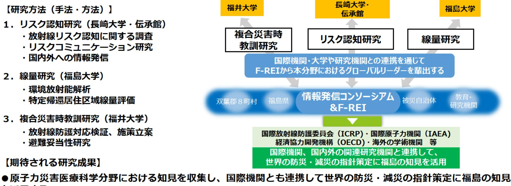

# 原子力災害に関するデータや知見の集積・発信(原子力災害医療科学)事業概要

F-REI

| 募集課題名 | 第5分野 令和5年度「原子力災害からの復興に向けた課題の解決に資する施策立案研究」委託事業 |
|---|---|
| 研究実施者 | 局村 昇 (長崎大学 福島未来創造支援研究センター・センター長) 原子力災害医療科学分野における福島の知見の集積と国内外への情報発信コンソーシアム (国立大学法人長崎大学(代表機関)、国立大学法人福井大学、国立大学法人福島大学、公益財団法人福島イノベーション・コースト構想推進機構東日本大震災・原子力災害伝承館) |
| 実施予定期間 | 令和11年度まで(ただし実施期間中の各種評価等により変更があり得る) |

## 【背景・目的】

福島県には原子力災害を含む複合災害の経験を通じた多くの知見があり、これらの知見を今後の国内外における防災、減災に活用する必要がある。本事業は、放射線リスク評価など原子力災害医療科学に関する知見を集積・分析し、ICRP、IAEA等の国際機関をはじめとする国内外の関連研究機関と連携し、国際的な防災・減災の指針の策定に貢献する。

## 【研究方法（手法・方法）】

1.リスク認知研究（長崎大学・伝承館）

- 放射線リスク認知に関する調査
- リスクコミュニケーション研究
- 国内外への情報発信

2.線量研究（福島大学）

- 環境放射能解析
- 特定帰還居住区域線量評価

3.複合災害時教訓研究（福井大学）

- 放射線防護対応検証、施策立案
- 避難妥当性研究

福井大学：複合災害時教訓研究
長崎大学・伝承館：リスク認知研究
福島大学：線量研究

国際機関・大学や研究機関との連携を通じて
F-REIから本分野におけるグローバルリーダーを輩出する

情報発信コンソーシアム& F-REI

国際放射線防護委員会（ICRP）・国際原子力機関（IAEA）
経済協力開発機構（OECD）・海外の学術機関等

国際機関、国内外の関連研究機関と連携して、世界の防災・減災の指針策定に福島の知見を活用

## 【期待される研究成果】

- 原子力災害医療科学分野における知見を収集し、国際機関とも連携して世界の防災・減災の指針策定に福島の知見を活用する
- 上記の取組を通じて、本分野におけるグローバルリーダーをF-REIから輩出する。

