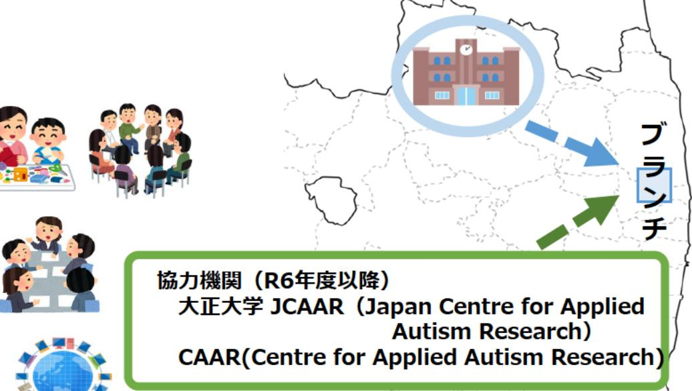

# 原子力災害に関するデータや知見の集積・発信(子どもと親のメンタルヘルス)事業概要

F-REI

| 募集課題名 | 第5分野 令和5年度「原子力災害からの復興に向けた課題の解決に資する施策立案研究」委託事業 |
|--------------|------------------------------------------------------------------------------------------------------------------------------------------|
| 研究実施者 | 内山 登紀夫(福島学院大学 福祉学部福祉心理学科 教授) |
| 実施予定期間 | 令和11年度まで（ただし実施期間中の各種評価等により変更があり得る） |

## 【背景・目的】

原子力災害の影響を受けた福島県においては、子どもと保護者のメンタルヘルスの調査が実施されてきた。本事業では、これらの調査結果を集積・分析するとともに、メンタルヘルス向上に向けた支援プログラムの検討及びその有効性の確認を行うことで、原子力災害に関する知見の集積に貢献する。

【研究方法(手法・方法)】

1. 調査研究(子どもの発達と保護者の メンタルヘルスの経時的変化)
2. 親子と支援者の支援サロン・交流の場の設定、 運営方法の開発
3. 発達障害を含む子どもを支援するための教材、 支援システムの開発、多様な子どもを支援する ための人材養成と研修システムの開発→1~3による施策立案の検討
4. 情報発信、普及啓発

## 【期待される研究成果】

福島浜通り地域の子どもと保護者が受けた中長期的な影響と課題が明らかになるとともに、乳幼児期から思春期・青年期までの発達支援及び保護者のための支援ブログラムを開発し、地域に実装することで支援の質の向上に寄与できる。

