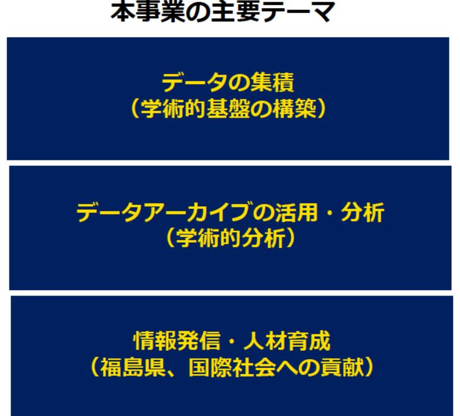

# 原子力災害に関するデータや知見の集積・発信(大規模災害とデータサイエンス) 事業概要

| 募集課題名 | 第5分野 令和5年度「原子力災害からの復興に向けた課題の解決に資する施策立案研究」委託事業 |
|--------------|------------------------------------------------------------------------------------------------------------------------------------------|
| 研究実施者 | 関谷 直也（東京大学大学院情報学環総合防災情報研究センター） (大規模災害とデータサイエンス研究コンソーシアム(国立大学法人東京大学(代表機関)、公益財団法人福島イノベーション・コースト構想推進機構東日本大震災・原子力災害伝承館、株式会社サーベイリサーチセンター) |
| 実施予定期間 | 令和11年度まで（ただし実施期間中の各種評価等により変更があり得る） |

## 【背景・目的】

原子力災害に伴い、マスメディア、行政広報、ソーシャルメディア等による様々な情報の発信、提供が行われた。本事業では、原子力災害に関するデータや知見の集積の観点から、「福島の経験」に関してマスメディア、行政広報、ソーシャルメディアが行った情報発信のデータを収集するとともに、それらの情報が人の行動・心理に与えた影響を分析することで、大規模災害時の情報提供のあり方に関する教訓を抽出する。

## 【研究方法(手法・方法)】

### 1. データの集積

  「福島の経験」に関するマスメディア、行政広報、SNSデータの収集など、記録データの収集・整理を行うともに、「住」「食」「意」を軸とした調査(ヒアリング調査、国際比較アンケート調査、大規模災害時の災害意識の長期的変化の分析等)人の行動・心理の集積を行う。

### 2. データアーカイブの活用・分析

集積した記録データのアーカイブ化、分析結果を用いた大規模災害時の情報提供のあり方の総括を行う。

### 3. 情報発信・人材育成

研究集会の開催等を通した情報発信を行うとともに、災害・災禍やリスクイベントに関する研究人材の育成を行う。

## 【期待される研究成果】

- 東日本大震災・原子力災害時の避難や心理、情報のデータ集積を行い、データのアーカイブ化・分析をすることで、大規模災害時の情報提供のあり方を総括することが期待される。それにより、同じような災禍が発生し、混乱したような状況でどのようなコミュニケーションが必要か考察が可能になる。
- 災害、災禍やリスクイベントに関する研究人材の育成が期待される。

