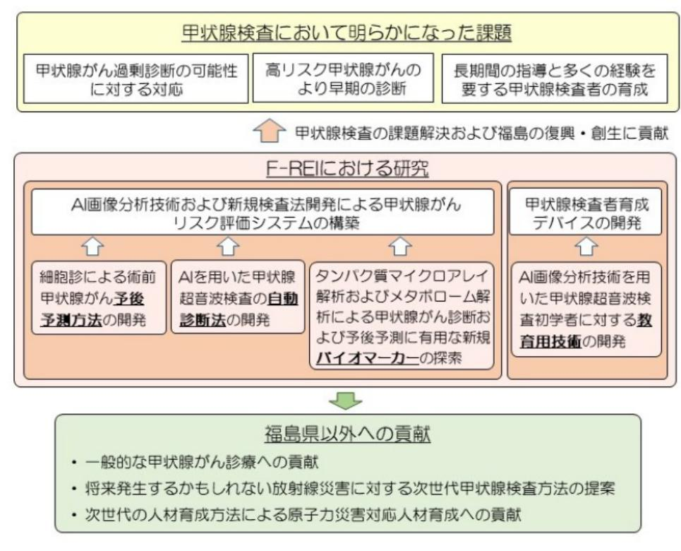

# 原子力災害に関するデータや知見の集積・発信(次世代甲状腺検査法および人材育成法の開発)事業概要

F-REI

| 募集課題名 | 第5分野 令和5年度「原子力災害からの復興に向けた課題の解決に資する施策立案研究」委託事業 |
|---|---|
| 研究実施者 | 志村 浩己(公立大学法人福島県立医科大学 臨床検査医学講座 教授) 次世代甲状腺検査法および人材育成法の開発コンソーシアム (公立大学法人福島県立医科大学(代表機関)、国立大学法人山梨大学、国立大学法人長崎大学) |
| 実施予定期間 | 令和11年度まで(ただし実施期間中の各種評価等により変更があり得る) |

## 【背景・目的】

原子力災害を経験した福島県においては、健康を長期的に見守ることを目的に甲状腺検査を実施してきた。これまで蓄積された甲状腺検査の経験に、人工知能技術を活用することにより、現状の甲状腺検査の課題の解決を目指し、次世代甲状腺検査法を開発するとともに、人工知能を活用した甲状腺検査を実施できる人材育成方法を開発する。

## 【研究方法(手法・方法)】

- 1.人工知能による画像分析技術および新規検査法開発による甲状腺がんリスク評価システムの構築
- 2.人工知能など最新技術を用いた甲状腺検査者の人材育成方法およびデバイスを開発する。

## 【期待される研究成果】

- 甲状腺検査の課題解決および福島の復興・創生への貢献
- 一般的な甲状腺がん診療への新規診断方法開発などによる貢献
- 将来の原子力災害の備えとしての次世代甲状腺検査方法の提案
- 次世代技術を活用した原子力災害対応人材の育成への貢献

