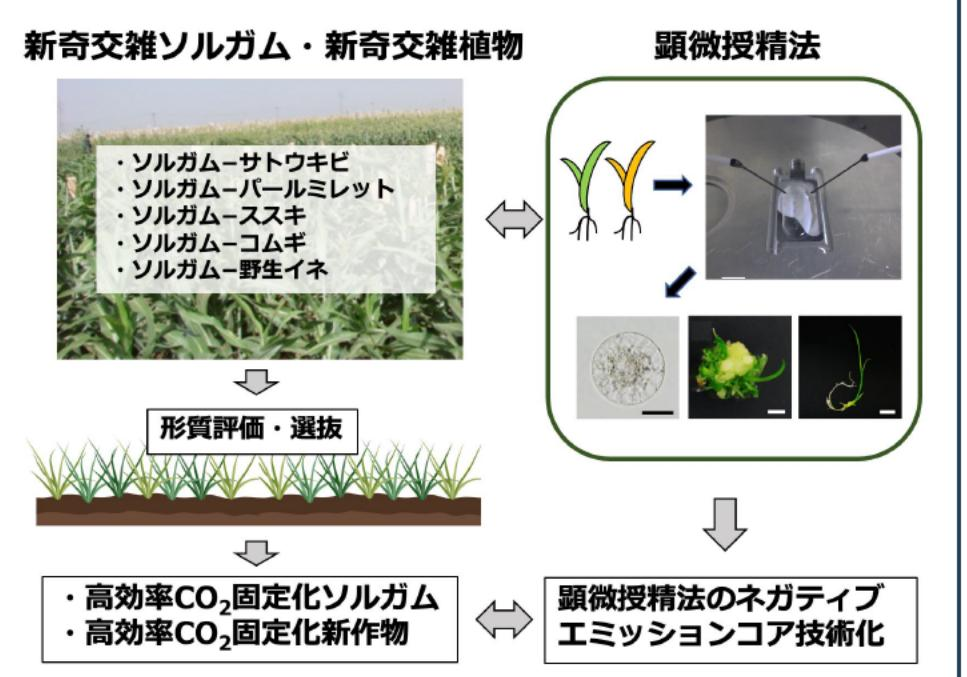

# 顕微授精法を用いた高効率CO2固定化植物の研究 事業概要

F-REI

|募集課題名|エネルギー分野 令和5年度「ネガティブエミッションのコア技術の研究開発・実証」委託事業  テーマ(1)植物のCO2固定及びネガティブエミッションへの利用に関する研究開発と実証|
|---|---|
|研究実施者|岡本 龍史(交雑植物コンリーシアム(東京都立大学(代表機関)、鳥取大学、国際農林水産業研究センター、国立遺伝学研究所))|
|実施予定期間 |令和11年度まで (ただし実施期間中の各種評価等により変更があり得る)|

## 【背景・目的】

ソルガム※1 は食料と競合しないバイオマス資源として注目されている。本課題では、顕微授精法※2により、これまで交配技術で出来なかった種や属が異なる植物の遺伝資源の導入を実現し、バイオマスによるネガティブエミッションのコア技術として、CO-を効率的に固定化できる新たな形質をもったソルガムの創出技術を開発する。
※1:イネ科の植物で、暑さに強い、生育が早い、有機物の生産量が多いなどの特徴がある。 ※2:植物の花器官から卵細胞と精細胞をそれぞれ単離し、それら配偶子を電気的に融合させて受精卵を作出する手法。

## 【研究方法(手法・方法)】

- 髄微授精法を用いて、
  - ソルガムと同じ亜科(キビ亜科)に属する植物(パールミレット、サトウキビ、ススキ等)との属間交雑植物
  - ソルガムと異なる亜科に属する植物(コムギ、野生イネ等)との亜科間交雑植物
  を創出し、ソルガムの耐寒性(越冬性)や乾燥耐 性等を向上させる。
- ソルガムを対象とした顕微授精法を高度化し、ネガティブエミッションのコア技術として確立する。

## 【期待される研究成果】

- CO2を効率的に固定化できる新たなソルガムの創出によるネガティブエミッション技術の実用化。

