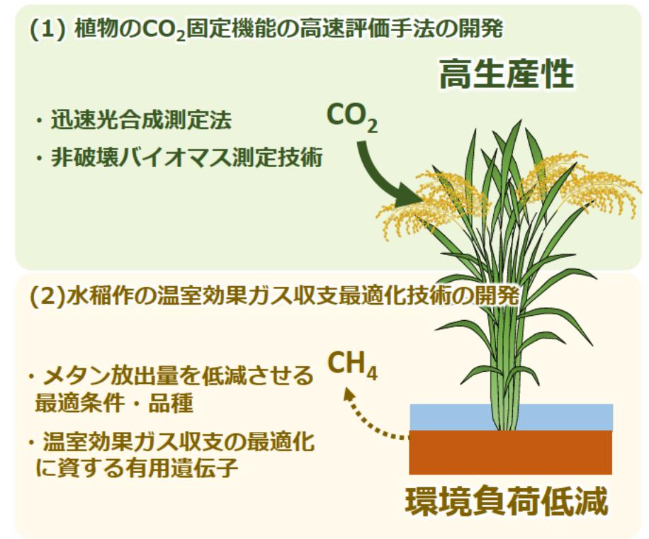

# 水稲のCO,固定機能の高速評価手法等の開発 事業概要

F-REI

| 募集課題名 | エネルギー分野 令和5年度「ネガティブエミッションのコア技術の研究開発・実証」委託事業 テーマ(1)植物のCO,固定及びネガティブエミッションへの利用に関する研究開発と実証 |
|---|---|
| 研究実施者 | 田中 佑(福島発ネガティブエミッション農業実現に向けた水稲のCO,固定機能強化技術の開発コンソーシアム(岡山大学(代表機関)、福島大学、東京農工大学、理化学研究所、山形大学、東北大学、東海国立大学機構) |
| 実施予定期間 | 令和11年度まで (ただし実施期間中の各種評価等により変更があり得る) |

## 【背景・目的】

水稲のCO、固定機能の高速評価手法を開発するとともに、水稲作からの温室効果ガス放出低減と高生産性を両立する品種や栽培法を開発する。

## 【研究方法(手法・方法)】

- 水稲のCO2固定機能を迅速に評価する装置やAI画像診断技術を開発する。
- 水田からのメタン放出量を推定するモデルを開発するとともに、そのメカニズム解明と低メタン栽培法を確 立する。さらに温室効果ガス収支の最適化に資する有用遺伝子を探索する。

## 【期待される研究成果】

- 水稲のCO2固定機能を正確かつ迅速に評価する技術の確立
- 水田からのメタン放出を低減するための土壌、栽培および品種などの条件の解明
- 環境負荷が小さく、かつ生産性の高い水稲作の確立によるネガティブエミッションのコア技術構築への貢献

環境負荷が小さく、生産性の高い水稲作の確立
