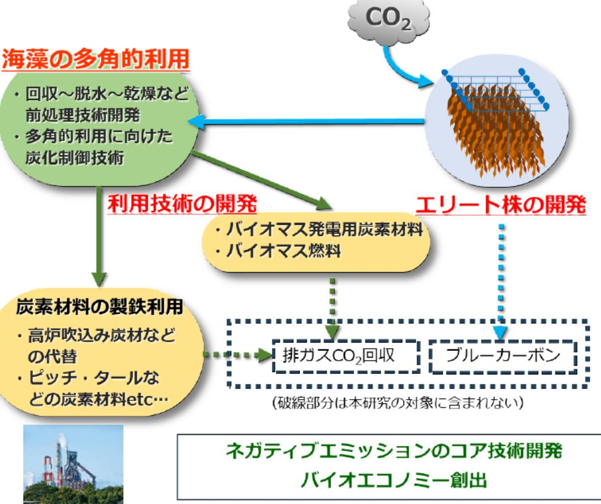

# ゲノム編集による高効率CO。固定海藻の作出と海藻の多角的利用等に関する研究 事業概要

F-REI

|募集課題名|エネルギー分野 令和5年度「ネガティブエミッションのコア技術の研究開発・実証」委託事業  テーマ(2) 藻類のCO。固定及びネガティブエミッションへの利用に関する研究開発と実証|
|---|---|
|研究実施者|小杉 知佳 (「バイオエコノミー創出を狙ったゲノム編集による海藻エリート株ならびに製鉄プロセス利用におけるBECCS相当技術の開発」共同研究機関(日本製鉄株式会社(代表機関)、一般財団法人金属系材料研究開発センター)|
|実施予定期間|令和11年度まで (ただし実施期間中の各種評価等により変更があり得る)|

## 【背景・目的】

ゲノム編集技術によりCO,固定能が高い海藻を作出するとともに、製鉄工程に利用可能な炭素材料を海藻から製造する技術を開発する。

## 【研究方法(手法・方法)】

### (1) CO2固定能が高い優良株及び養殖技術の開発

- ゲノム編集によりCO2固定能が高く成長が早い海藻を作出する(マコンブ、スジメを対象)。
- 高効率な養殖技術を開発するとともに、海域での養殖時の環境影響を回避する養殖管理方法を確立する。

### (2) 製鉄工程に利用可能な炭素材料等の製造技術の開発

- 製鉄工程やバイオマス発電に利用可能な海藻由来の炭素材料や燃料の製造方法を研究する。
- 海藻の育種から炭素材料の生産・利用までの全体を通じたLCA*を行い、CO2削減効果を評価する。

※ライフサイクルアセスメント(LCA):製品のライフサイクル全体(原料採取 生産-消費-廃棄)における環境負荷を定量的に評価する手法。

## 【期待される研究成果】

- 海藻のCO2固定能を向上できるゲノム編集技術をネガティブエミッション技術としてコア技術化
- 海藻を製鉄ブロセスで多角的に利用する技術の開発

