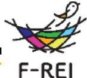
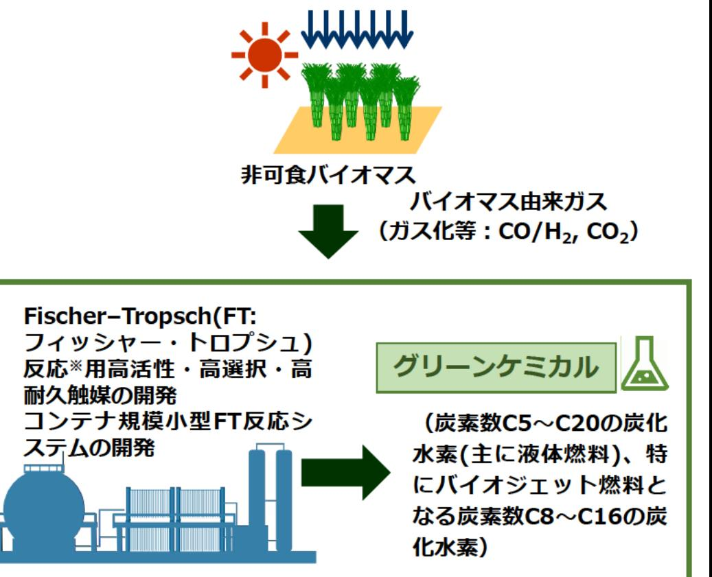

# バイオ統合型グリーンケミカルプロセスによるCO,資源化 事業概要

F-REI

|募集課題名|エネルギー分野 令和5年度「バイオ統合型グリーンケミカル技術の研究開発」(バイオ統合型グリーンケミカルブロセスによるCO2資源化)|
|---|---|
|研究実施者|山口 和也(東京大学)|
|実施予定期間 |令和11年度まで (ただし実施期間中の各種評価等により変更があり得る)|

## 【背景・目的】

福島におけるバイオマス由来の原料ガス※をカーボンニュートラル炭素の原料とし、再生可能エネルギー由来の水素も活用して有用なグリーン化学品(主に液体燃料)を得るプロセスの統合化に関する研究開発を行う。

※バイオマスをガス化等することによって得られるCO/H2,CO2

【研究方法(手法・方法)】

原子スケールでの反応の理解に基づいた高活性及び高耐久性を有する触媒を開発し、コンテナ規模の小型FT合成装置によってグリーン化学品(液体燃料)を選択的に製造できる製造システムを構築し社会実装する。

その際に、バイオマス由来の原料生産からグリーン化学品の製造までの各プロセスについて、経済合理性を満たしつつ、環境影響が低減されるよう、ライフサイクル全体での評価を行いプロセスを統合化する。

【期待される研究成果】

- カーボンニュートラル社会実現に寄与する先端的なグリーン化学品製造システムの構築
- 福島におけるバイオマスの有効利用
- 福島での新産業の創出・誘致・集積

非可食バイオマス
バイオマス由来ガス
（ガス化等：CO/H2, CO2）

Fischer-Tropsch(FT:フィッシャー・トロプシュ）
反応※用高活性・高選択・高耐久触媒の開発
コンテナ規模小型FT反応システムの開発

グリーンケミカル
炭素数C5～C20の炭化水素（主に液体燃料）、特にバイオジェット燃料となる炭素数C8～C16の炭化水素）

FT反応:一酸化炭素(CO)と水素(H2)から触媒反応を用いて炭化水素を合成する反応
