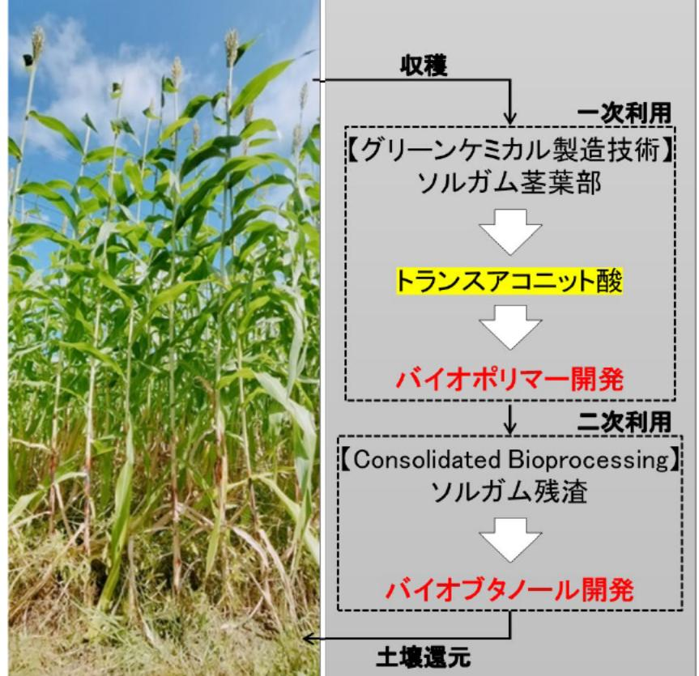

# ソルガムに含まれる有用物質の活用やバイオブタノール製造の技術開発に関する研究 事業概要

F-REI

|募集課題名|エネルギー分野 令和5年度「ネガティブエミッションのコア技術の研究開発・実証」委託事業テーマ(1)植物のCO2固定及びネガティブエミッションへの利用に関する研究開発と実証 |
|-----|---|
| 研究実施者|田丸 浩(ソルガム利活用コンソーシアム(東北大学(代表機関)、三重大学、大阪公立大学)) |
|実施予定期間 |令和11年度まで (ただし実施期間中の各種評価等により変更があり得る)|

## 【背景・目的】

福島県浜通りで栽培実績のあるソルガム*によるネガティブエミッションのコア技術の研究開発及びバイオボリマ―などグリーンケミカル製造の実証に取り組む。

※イネ科の植物で、暑さに強い、生育が早い、有機物の生産量が多いなどの特徴がある。

## 【研究方法(手法・方法)】

- 分化していない状態のソルガム細胞の塊(カルス)を作製し、カルスにゲノム編集技術を用いて代謝関連遺伝子を改変することで、ソルガムに含まれるトランスアコニット酸(ポリマー合成等の原料)の蓄積能力を高め、バイオポリマー開発につなげていく。
- ソルガム残済を分解・糖化・発酵まで一貫して微生物処理する際に併せて通電培養を行うことで、バイオブタノール(バイオ燃料等の原料)生産を高効率化する技術開発を行う。

## 【期待される研究成果】

- ゲノム編集等によりソルガムの有効活用を可能することでネガティブエミッションに資する技術の構築
- ソルガム残済からの高効率なバイオブタノール製造技術の構築

