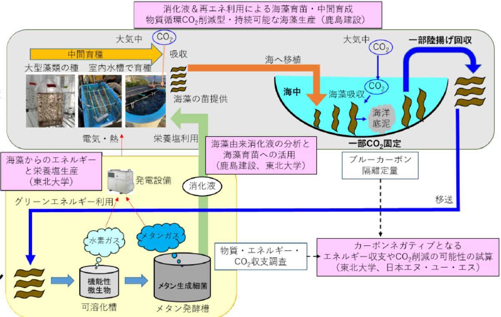

# ネガティブエミッションコア技術研究(海藻のメタン発酵の高度化、副生成物の活用) 事業概要

F-REI

| 募集課題名 | エネルギー分野 令和5年度「ネガティブエミッションのコア技術の研究開発・実証」委託事業 テーマ(2) 藻類のCO2固定及びネガティブエミッションへの利用に関する研究開発と実証 |
|---|---|
| 研究実施者 | 多田 千佳 (浜通りブルーカーボンによるネガティブエミッションシステムの構築のためのコンソーシアム (東北大学(代表機関)、鹿島建設株式会社)) |  
| 実施予定期間 | 令和11年度まで (ただし実施期間中の各種評価等により変更があり得る) |  

## 【背景・目的】

ブルーカーボン(海藻など海洋生態系に取り込まれた炭素貯留)は、ネガティブエミッション技術の一つとして注目されている。本研究では、ブルーカーボンによるネガティブエミッションの実現に向けたコア技術として、海藻を原料とするメタン発酵を牛の第一骨に共生する微生物を活用して高効率化する技術開発と、そのメタン発酵プロセスから副生される栄養塩などを海藻育苗等に活用可能性やCO2削減可能性の調査研究する。

## 【研究方法(手法・方法)】

1. 海藻からのエネルギー生産の効率化

    植物繊維の分解能力の高い牛の第一貫に共牛する微生物の分離培養、活用により海藻からのメタン発酵の効率を向上させる技術開発を行い、エネルギー生産の効率化を図る。

2. 海藻由来の溶液の分析と海藻育苗等への活用
  
    海藻のメタン発酵で副生される栄養塩などを海藻育苗等への利用可能性を調査研究するとともに、CO2削減可能性についても調査研究を行う。

## 【期待される研究成果】

ブルーカーボンを用いたネガティブエミッションの実現に向けたコア技術の確立。

