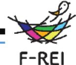

# 困難環境の課題を解決する「空間エージェント網」の研究 事業概要

F-REI

|募集課題名|ロボット分野 令和5年度[困難環境下でのロボット・ドローン活用促進に向けた研究開発事業」委託事業  テーマ(1)災害現場など困難環境での活用が見込まれる強靱なロボット・ドローン技術の研究開発|
|---|---|
|研究実施者|田所諭(空間工-ジェント網研究コンソーシアム(東北大学(代表機関)、情報通信研究機構、広島大学、筑波大学、制御システムセキュリティーセンター、大阪大学) )|
|実施予定期間|令和11年度まで (ただし実施期間中の各種評価等により変更があり得る) |

## 【背景・目的】

災害等の困難環境においては、単体のロボット・ドローンだけでは必要とされる機能を発揮できない場面が多い。様々な機能エージェントが多数で協力して困難課題を解決する「空間エージェント網(Spatial Agents Web)」という概念を実現し、多様なロボット・ドローンが困難環境下で機能を発揮できるための基盤を構築する方法を研究する。 ※エージェント:人間の代理として働くAI。環境や状況の理解に基づいて最適な行動を行う知能体。

## 【研究方法(手法・方法)】

- 瓦礫等の災害環境の狭い空間等の移動困難な環境下でのロボットの高い運動性能の実現
  移動面での物理的な障害を解決し、瓦礫内協調探育や狭い空間に進入することを可能にする、ロボットやドローンの改良研究

- 災害等の環境下での遠隔自律知能研究
センシング・作業を自律的に実施するための、空間での能動的情報検索を可能にする研究、デジタルツイン の研究、及び被災プラント等の困難空間の理解・データ化の研究

- 通信と位置推定の課題克服
通信と位置推定の信頼性を確保するための、電波位相マッピング技術によるロボットの最適行動の研究

### 空間エージェント網

- 様々なロボット
- 多数ドローン
- 大規模AI
- 超多数IoT
- 人間の操作

### 困難の解決

- 移動のフィジカルな困難
- センシング・作業の自律知能の困難解決
- 通信と信頼性の困難の解決
- 人間との共同作業の困難の解決

多様なロボット・ドローンが困難環境下で機能を発揮するシステム

## 【期待される研究成果】

- 困難空間内で必要な救助等の災害対応活動を可能にする
