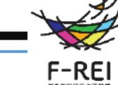
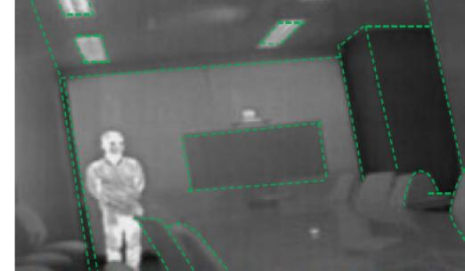
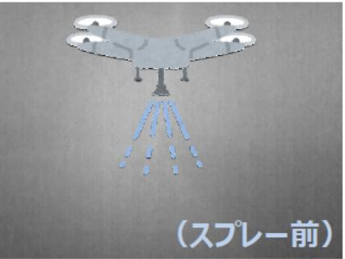
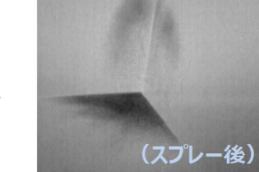

# 煙が充満した環境における熱画像からの三次元環境地図生成 事業概要

F-REI

|募集課題名|ロボット分野 令和5年度「防災・災害のためのドローンのセンサ技術研究開発事業」委託事業|
|---|---|
|研究実施者|ラサミー ポチヤラ (大阪工業大学)|
|実施予定期間| 令和6年6月末まで|

## 【背景・目的】

火災現場等の煙が充満した環境では、建物内の延焼状況や構造の情報が不足しているため、救助や鎮火に多大な時間を要している。

本事業ではドローンに搭載し、煙の中での要救助者探索を実現するセンシング技術の開発を行い、火災現場等の環境下での要救助者探索の迅速化を目指す。

## 【研究方法】

- 煙の影響を受けにくいサーマルカメラを活用し、火災現場等の煙が充満した建物の環境内でも三次元環境地図生成が可能となるセンサ技術を開発する。
- 部屋の隅など、サーマルカメラの熱画像で輪郭の認識が困難な箇所については新開発のミスト・ノズル・スプレー・アレイにより温度差を生成することで、高精度の三次元環境地図生成の実現を目指す。

## 【期待される研究成果】

- 三次元環境地図生成精度の向上
- 火災現場における救助及び消火活動の迅速化

熱画像からの三次元環境地図生成のイメージ

スプレー前

スプレー後
